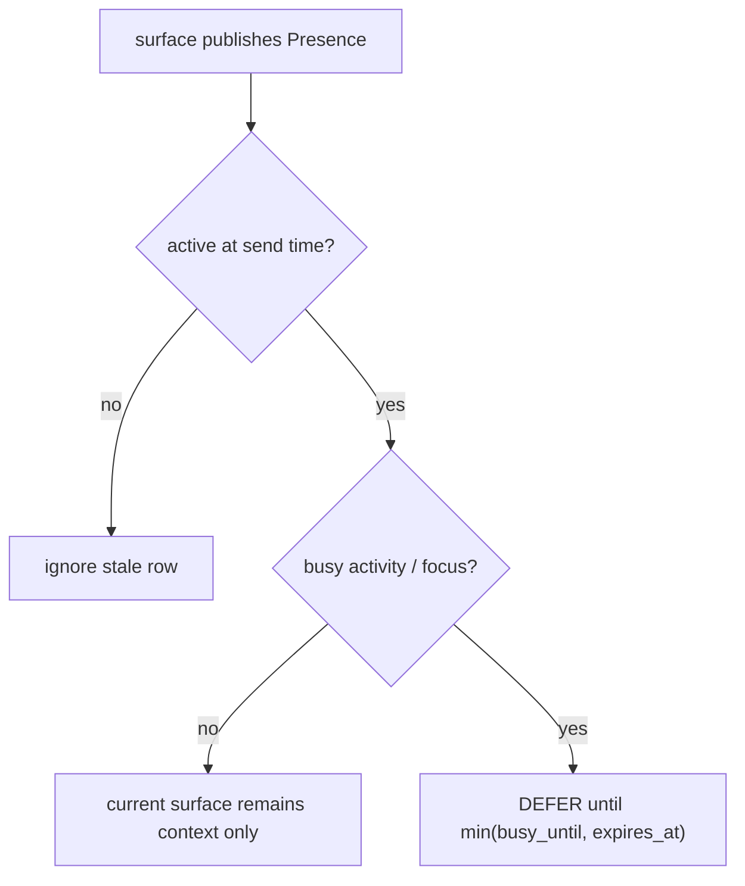

[← Delivery Objects and Results](10-Delivery-Objects-and-Results.md) · [Folder map](README.md)

# Delivery Context Resolver and leased presence

Quiet hours answer what is usually humane. Presence answers what is humane **right now**. A user
may be presenting, coding in focus mode, reviewing CRM, active on mobile or idle; Layer 5.2 can use
that context only when a trusted GeniOS surface reports it explicitly.

## Presence contract

```text
Presence {
  org_id, seat_id,
  activity, surface, focus_mode,
  observed_at, expires_at,
  busy_until?
}
```

Allowed activities are fixed: idle, email, CRM, coding, meeting, presenting, focus, mobile and
unknown. Coding, meeting, presenting and focus are busy activities. `focus_mode` independently
makes the lease busy.

## Lease law

`expires_at > observed_at` is enforced by both the contract and migration `0044`. A crashed browser
or mobile client can make delivery conservative only until its lease expires; it cannot leave a
person permanently busy. An explicit `busy_until` is bounded by the lease.



## Resolver order

`PgDeliveryContext.resolve` combines field-by-field delivery preferences, channel/recipient
registration, burst state and active presence at the exact drain instant. The Timing Unit receives
the resolved profile/state, not database access.

Calendar data is deliberately not treated as live presence: a meeting can end early, and focus
work may not exist on a calendar. Automatic calendar/client projection remains open; today an
owner-authenticated product surface publishes and clears leases through `/delivery/context`.

## API

- `PUT /api/org/{org}/delivery/context` publishes or renews a bounded lease; `seat_id` is in the
  owner-authenticated request body until the platform has a trusted seat-identity credential.
- `GET .../delivery/context/{seat}` shows stored and effective busy state.
- `DELETE .../delivery/context/{seat}` clears it.

All rows cascade on tenant deletion. Expired rows are ignored even before physical cleanup.
