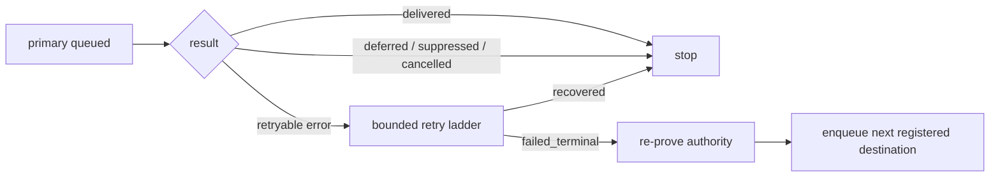

[← Presence and Context Resolver](11-Presence-and-Context-Resolver.md) · [Folder map](README.md)

# Destination routing, adapters and failure recovery

Audience and commitment channel authority stay upstream. Destination routing answers a narrower
question for card delivery: among destinations this tenant actually registered, which concrete
adapter is primary and which can recover a terminal transport failure?

## Deterministic ordering

`RegisteredDestination.priority` uses an explicit integer when present, otherwise stable defaults:

```text
Slack 100 → Teams 90 → signed webhook 80 → pull surfaces 10
```

Ties break on channel name, never database row order. Digest eligibility is separate; registered
Slack/Teams may receive digest output while pull surfaces remain per-item inboxes.

## Adapters

| Adapter | Success means | Security/validation |
|---|---|---|
| Slack | incoming webhook accepted | secret URL masked in API output |
| Teams | Incoming Webhook/anonymous Workflow accepted | only recognized Microsoft endpoint hosts |
| Signed webhook | customer HTTPS endpoint accepted | canonical JSON, HMAC-SHA256, public-host validation |
| Pull surface | row is available through authenticated inbox | no fabricated external/device send |

`in_app`, dashboard, API, application, extension and mobile are pull adapters. “Delivered” means
available through that authorized surface. Mobile is not APNs/FCM and is never documented as such.

## Recovery law



Failover cannot route around quiet hours, opt-out, compliance policy, recipient-busy state or
revoked authority. Only exhausted transport failure qualifies. Layer 5 commitment reminders are
stricter still: the bridge executes their frozen channel plan and does not choose a replacement.

The retry ladder remains 5, 30, 120 and 720 minutes. Claims use `FOR UPDATE SKIP LOCKED`; unique
`(org, card, channel)` intent prevents duplicate enqueue.

Production still needs real-provider credentials, controlled outage tests and network-level egress
controls. Native email and APNs/FCM adapters are explicit gaps rather than fake surface aliases.
