# Layer 6 · Intelligence Distribution — the folder map

**This folder is the live truth of `genios_engine/deliver/`.** It is the source consulted before any action,
update or improvement to this layer. If a document and the code disagree, the document is wrong —
fix it in the same change that moved the code.

Start at **[00-Overview.md](00-Overview.md)** for the layer in one sitting. Use this page when you
already know what you are looking for.

---

## The one question this layer answers

> **May this reach them, now — and how does it look when it arrives?**

```mermaid
flowchart TD
    R["Layer-6-Intelligence-Distribution/"] --> A["01-Card-Production.md<br/><i>build · render · validate · persist</i>"]
    R --> B["02 · 03 · 04<br/><i>SEND / DEFER / SUPPRESS — policy, timing, the gate</i>"]
    R --> C["05-Reason-Codes.md<br/><i>every blocked delivery names itself</i>"]
    R --> D["06 · 07<br/><i>outbox, chat, webhook, pull and agent surfaces</i>"]
    R --> E["08-Bugs-Runbook-and-Gaps.md"]
    R --> F["09-Atlas-Layer-5.2-Alignment.md<br/><i>Atlas component-by-component truth</i>"]
    R --> G["10-Delivery-Objects-and-Results.md<br/><i>typed boundary over one durable ledger</i>"]
    R --> H["11-Presence-and-Context-Resolver.md<br/><i>leased activity, surface and busy state</i>"]
    R --> I["12-Destination-Routing-and-Failover.md<br/><i>primary route, adapters and recovery law</i>"]
    R --> J["13-Surfaces-Analytics-and-Learning-Handoff.md<br/><i>pull delivery, metrics and Atlas L6 input</i>"]
```

---

## The documents

| # | Document | Answers |
|---|---|---|
| 00 | [Overview](00-Overview.md) | The two halves, the two forks, workflows, strategies |
| 01 | [Card Production](01-Card-Production.md) | Slots, the one model call, and the two gates that stand between it and a user |
| 02 | [The Admission Contract](02-The-Admission-Contract.md) | Why DEFER is not a failure, and why constraints compose rather than race |
| 03 | [Policy and Timing](03-Policy-and-Timing.md) | *May this travel at all?* versus *is this the moment?* |
| 04 | [The Delivery Gate](04-The-Delivery-Gate.md) | Why it runs at drain, and why before authority re-validation |
| 05 | [The Thirteen Reason Codes](05-Reason-Codes.md) | What each means and what an operator should do |
| 06 | [Transport and the Outbox](06-Transport-and-Outbox.md) | Claim, backoff, and the three outcomes |
| 07 | [Channels, Digest and Agents](07-Channels-Digest-and-Agents.md) | Slack, Teams, signed webhook, pull inboxes, digest and agent surfaces |
| 08 | [Bugs, Runbook and Gaps](08-Bugs-Runbook-and-Gaps.md) | Fixed defects, deployment runbook and the remaining provider/infrastructure gaps |
| 09 | [Atlas Layer 5.2 Alignment](09-Atlas-Layer-5.2-Alignment.md) | Every Atlas component and delivery unit mapped to executable code or an explicit gap |
| 10 | [Delivery Objects and Results](10-Delivery-Objects-and-Results.md) | Immutable public contracts projected from the outbox without a second source of truth |
| 11 | [Presence and Context Resolver](11-Presence-and-Context-Resolver.md) | Leased recipient activity, current surface, busy holds and expiry safety |
| 12 | [Destination Routing and Failover](12-Destination-Routing-and-Failover.md) | Registration, deterministic priority, adapters and the terminal-failure-only fallback law |
| 13 | [Surfaces, Analytics and Learning Handoff](13-Surfaces-Analytics-and-Learning-Handoff.md) | Pull inbox semantics, metrics, result APIs and Atlas Layer 6 consumption |

---

## Where this layer sits

| | |
|---|---|
| **Package** | `genios_engine/deliver/` |
| **Layer number** | 6 — `genios_engine/LAYERS.py` |
| **Spec alias** | The architecture atlas calls this **Layer 5.2 · Delivery Engine**. The code numbers it 6, between `executive` and `feedback` |
| **Reads from** | authoritative signals (L4) · execution events (L5) |
| **Hands to** | Slack/Teams · signed webhooks · authenticated pull surfaces · daily digest · agent APIs/webhooks |
| **May import** | `executive/` (L5) and everything below |
| **LLM calls** | **One temp-0 call per card**, for copy only, behind two deterministic gates |

[← System Design index](../README.md)
