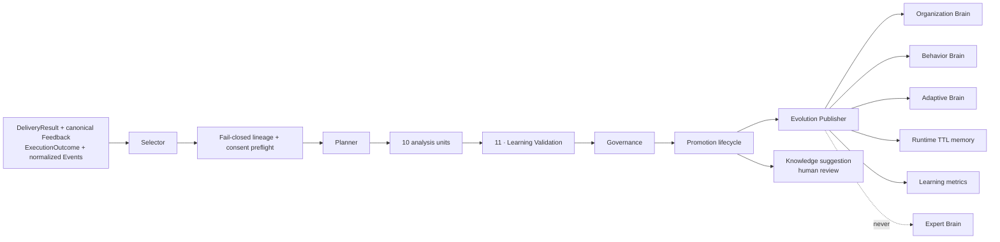

# Layer 6 overview

Learning accepts explicit feedback, execution outcomes, delivery performance and normalized
enterprise events. Pure units propose immutable `LearningObject` values. Validation and tenant
governance decide whether a proposal may progress; publishers write only the closed set of dynamic
targets.

## Current operational truth

- Weekly processing is tenant-scoped and claimed atomically.
- Every Layer 6 mutation first holds the tenant's `orgs` row `FOR SHARE`; reset/delete takes that
  same row `FOR UPDATE`. Where policy is needed, its row is locked next, before any LearningObject,
  memory or subject advisory lock. This is the global erasure-safe/deadlock-safe root order.
- Retention commits independently and still runs when learning consent is disabled or analysis
  later fails.
- Inputs are reconstructed from append-only feedback revisions, ExecutionOutcome, exact verified
  ExecutionObjects, graph source refs/events, structured inbox events and delivery event history.
- Terminal dashboard judgments (`run_play`, `do_it_myself`, `wrong`) atomically update one
  versioned canonical feedback verdict. `wrong:bad_timing` remains a verdict for audit/versioning
  but is timing/neutral—not negative quality. Dashboard requeue and both dashboard/extension
  snooze remain lifecycle/timing audit only and never create a verdict revision.
- Malformed rows are isolated in a sanitized hash-only rejection ledger; one bad row cannot poison
  the tenant run.
- Explicit temporary memories enter through an idempotent source-ref inbox with bounded future
  expiry.
- Every `learning.v2` proposal is immutable and content-addressed, with first/last observation,
  independent evidence, trace, visibility, lineage completeness and optional subject principal.
- Validation and governance are separate; high confidence cannot bypass tenant policy.
- User-scoped preferences are always reduced to a private ACL for the one resolved subject. Missing
  or source-excluded subjects fail preflight, and Behavior/Adaptive derivations preserve that cap.
- Policy revisions are immutable; every run/object pins the revision that governed it, and review
  revalidates against the locked current policy.
- Because policy and evaluation time are not evidence identity, a later claimed week may safely
  re-evaluate an identical object only while it is Observed or Candidate. Candidate never regresses
  to Observed; review, published and every later/terminal lifecycle state never reopen. Each actual
  decision appends its run, policy revision, evaluation time, prior/result state and final
  sink-level reason to `learning_object_evaluations` without rewriting the proposal.
- Runtime TTL memory cannot enter human review: owner API and database policy reject that setting,
  while valid explicit memory is published as a lease and later expires.
- Organization/Behavior/Adaptive rows, Runtime memories and metrics are published and API-visible.
- Publication is serialized per tenant+brain+subject, preserves ACL changes as material versions,
  keeps monotonic supersession lineage and can restore a safe predecessor on rollback.
- Review performs no-lock identity discovery, then tenant → policy `FOR SHARE` → object `FOR UPDATE`
  and recheck. Rollback discovers its predecessor/policy keys, locks policies in sorted order, then
  takes the subject advisory and object/topology row locks. Discovery never grants mutation authority.
- Generic new brain rows and Runtime memories do **not** yet affect lower runtime layers.
- The older narrow `rule_mutes` and bounded `lvl3_config.rule_offsets` calibration path is the
  learned state currently consumed by Reasoning.
- Knowledge Evolution produces a human-review suggestion; it does not edit Expert Brain or code.

That last boundary is the difference between “publisher implemented” and “closed adaptive product
loop.” See [STATUS.md](STATUS.md).
