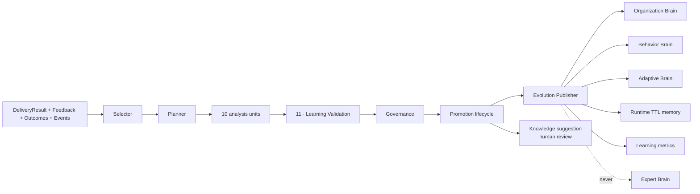

# Layer 6 overview

Learning accepts explicit feedback, execution outcomes, delivery performance and normalized
enterprise events. Pure units propose immutable `LearningObject` values. Validation and tenant
governance decide whether a proposal may progress; publishers write only the closed set of dynamic
targets.

## Current operational truth

- Weekly processing is tenant-scoped and claimed atomically.
- Explicit temporary memories may enter immediately with bounded future expiry.
- Every proposal is immutable, content-addressed and backed by evidence statistics/source refs.
- Validation and governance are separate; high confidence cannot bypass tenant policy.
- Organization/Behavior/Adaptive rows, Runtime memories and metrics are published and API-visible.
- Generic new brain rows and Runtime memories do **not** yet affect lower runtime layers.
- The older narrow `rule_mutes` and bounded `lvl3_config.rule_offsets` calibration path is the
  learned state currently consumed by Reasoning.
- Knowledge Evolution produces a human-review suggestion; it does not edit Expert Brain or code.

That last boundary is the difference between “publisher implemented” and “closed adaptive product
loop.” See [STATUS.md](STATUS.md).
