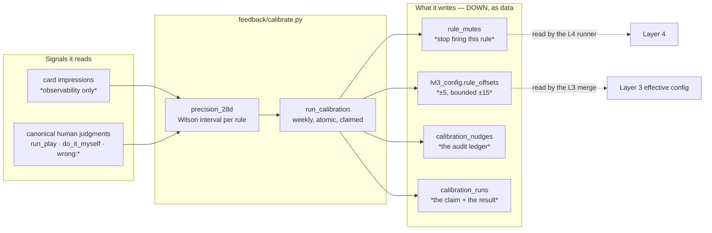
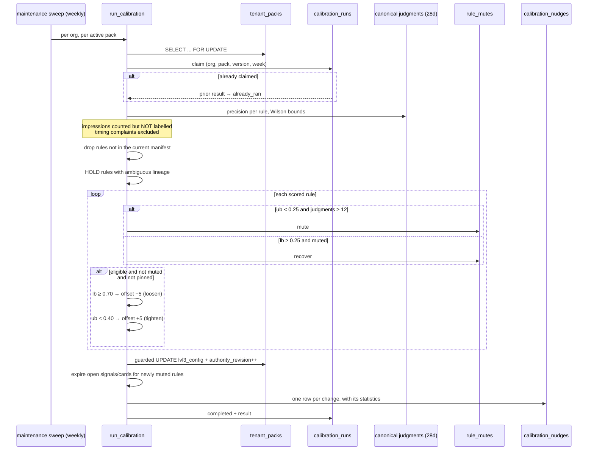
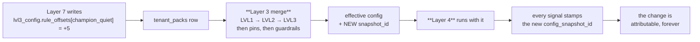

[Folder map](README.md) · [System Design index](../README.md)

---

# Layer 7 — The Learning Engine (`feedback/`)

> The layer that closes the loop — and the one that is deliberately the most **conservative** in
> the engine.

Every other layer produces intelligence. Layer 7 asks whether it was any good, and adjusts. But
it may only adjust in one direction, through one door, once a week, within a bounded range, and
never by importing anything above it.

**401 lines. It is the smallest layer, and its restraint is the design.**

---

## §0 · At a glance

| | |
|---|---|
| **Package** | `genios_engine/feedback/` |
| **Layer number** | 7 |
| **Size** | 2 files · 401 lines |
| **Input** | canonical human judgments on cards (Layer 6) |
| **Output** | `rule_mutes` rows + `lvl3_config.scoring_defaults.rule_offsets` (Layer 3 data) |
| **May import** | everything below. **Nothing imports it** |
| **Writes upward?** | **Never.** It writes **down, as data** |
| **LLM calls** | Zero |
| **Cadence** | **once per UTC week**, per pack, per org — claimed atomically |
| **Migration** | `0012_l6_feedback.sql`, `0034_l4_learning_authority.sql` |

---

---

## §1 · What was supposed to be built

From the layer map:

> **`feedback/` — Layer 7 — Learning Engine.** Precision windows, nudges, mutes, MACV. **Writes
> learned state DOWN as data** (`rule_mutes`, `lvl3_config`) — **never imported upward.**

Which implies four requirements:

| # | Requirement | Why it is non-negotiable |
|---|---|---|
| 1 | **Learn from labels, not from silence** | an ignored card is not a rejected card |
| 2 | **Bounded, reversible adjustments** | a learner that can move a threshold arbitrarily is a second reasoning engine |
| 3 | **One write path, respecting pins** | *the calibrator gets no private door* |
| 4 | **Exactly one run per period, atomically** | a double-run would double-step every nudge |

---

---

## §2 · What exists

**Nothing in Layer 7 imports Layer 3 or Layer 4.** The loop closes through *tables*.

---

---

## §4 · The workflows

### W1 · One weekly calibration

### W2 · How a nudge reaches a decision

**No import. No call. A table.**

---

---

## §5 · Strategies

### S1 · Silence is not a label

Impressions are observability. Only an explicit human judgment moves anything.

### S2 · Separate "wrong about the world" from "wrong moment"

`bad_timing` and `snooze` are excluded from precision. **A delivery problem must never mute a
correct rule.**

### S3 · Always compare against the harder bound

Mute on the **upper** bound, recover on the **lower** bound, loosen on the **lower**, tighten on
the **upper**. Small samples cannot act.

### S4 · Harder to silence than to tune

`MUTE_MIN_JUDGMENTS` (12) > `MIN_JUDGMENTS` (8), *because a mute stops the rule producing the
judgments that would let it recover.*

### S5 · Bounded and slow

±5 per week, ±15 total. **Learning may nudge; it may never redefine.**

### S6 · Never pool across lineages

Outcomes belong to the exact pack version that produced them. Ambiguity → **hold**, and report it.

### S7 · One transaction, one week, one claim

Serialised on the tenant-pack row, claimed on `(org, pack, version, week)`, guarded on
`authority_revision`.

### S8 · A mute takes effect immediately

Open signals and queued cards for a newly muted rule are expired in the same commit.

### S9 · Write down, never up

The only outputs are rows. Nothing in `feedback/` is imported by anything.

---

---

## §7 · The map

### 7.1 Files

| Concern | File |
|---|---|
| Everything | `feedback/calibrate.py` |
| The judgment CTEs it builds on | `reason/authority.py` (`AUDITED_CARD_JUDGMENTS_CTES`) |
| The write path it uses | `packs/registry.py` (`write_lvl3_offset`) — *and its own guarded UPDATE* |
| Where its output is consumed | `packs/merge.py` (LVL3), `reason/runner.py` (`rule_mutes`) |

### 7.2 Tables

`rule_mutes` · `calibration_runs` · `calibration_nudges` · `tenant_packs.lvl3_config` ·
`tenant_packs.authority_revision`

### 7.3 Endpoints

| Endpoint | Purpose |
|---|---|
| `POST /feedback/calibrate` | force a pass |
| `GET /feedback/precision` | the 28-day precision table with Wilson bounds |
| `GET /v1/expertise/learned` | the nudges + auto-mutes this tenant has accrued |

### 7.4 Where it runs

Inside `run_maintenance_sweep`, **weekly**, per active pack per org — after distribution, before
graph maintenance. Every failure is caught per org: *one org's failure ≠ the rest.*

### 7.5 Scorecard against §1

| Required | Status |
|---|---|
| Learn from labels, not silence | ✅ impressions are diagnostics only |
| Bounded, reversible adjustments | ✅ ±5/week, ±15 total, mutes recover |
| One write path, respecting pins | ✅ pin checked in Python **and** in SQL |
| Exactly one run per period, atomically | ✅ row lock + claim + revision guard, one transaction |
| Statistically honest | ✅ Wilson bounds, harder-bound comparisons |
| Never imported upward | ✅ the loop closes through tables |
| **Learns whether acting on it *worked*** | ❌ **`execution_outcomes` unread** |
