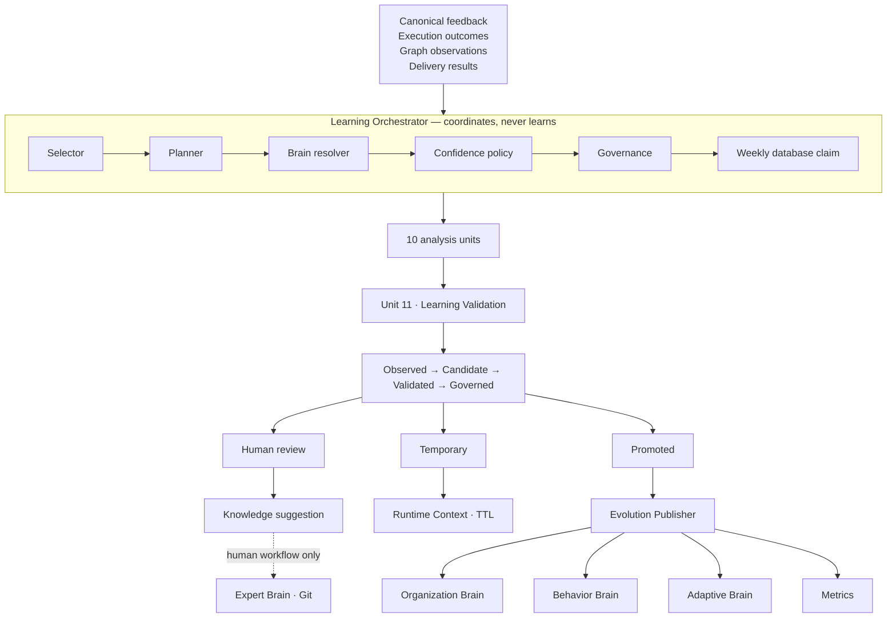
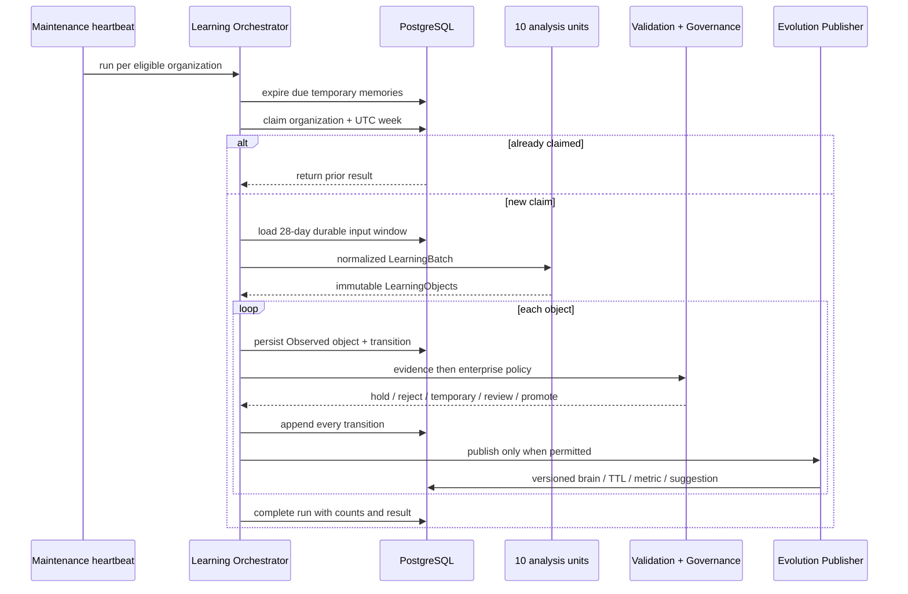

[Folder map](README.md) · [System Design index](../README.md)

# Layer 7 in code · Layer 6 in Atlas — Learning & Evolution

The previous implementation was a strong but narrow calibration loop: explicit card judgments,
Wilson bounds, mutes and bounded threshold nudges. The live layer now keeps that subsystem and
adds the Atlas-wide Learning Engine around it.

## At a glance

| | |
|---|---|
| Package | `genios_engine/feedback/` |
| Atlas name | Layer 6 · Learning & Evolution Engine |
| Code layer | 7, after `deliver/` |
| Inputs | `DeliveryResult + Feedback + Enterprise Events`, including real execution outcomes |
| Output contract | immutable, content-addressed `LearningObject` |
| Dynamic brains | Organization · Behavior · Adaptive |
| Other outputs | Runtime memory with TTL · learning metrics · knowledge review suggestions |
| LLM in decisions | None |
| Cadence | weekly claimed evolution + immediate governed explicit memory |
| Main migration | `0045_atlas_l6_learning.sql` |

## Component architecture

There is no edge from code to the Expert Brain. Approval of a knowledge suggestion records the
human decision and handoff; it does not edit a pack or Git.

## What changed from the calibration-only layer

| Before | Now |
|---|---|
| Card clicks measured apparent relevance | `execution_outcomes` measure whether acting worked |
| One calibration module | typed contract, 11 units, governance, store, orchestrator, API |
| Rule mutes + one bounded offset | three dynamic brains, runtime TTL, metrics, knowledge suggestions, plus calibration |
| No generic promotion lifecycle | complete audited Atlas state machine |
| No tenant learning policy surface | owner-controlled confidence, repetition, noise, conflict, review and TTL policy |
| No rollback surface | versioned dynamic brain entries and explicit rollback |

## The safety model

1. **Silence is not evidence.** Only explicit feedback enters preference/feedback learning.
2. **One occurrence is not permanent learning.** Defaults require three observations over two
   distinct days and 6500 confidence basis points.
3. **Validation and permission are separate.** Strong evidence can still be rejected or routed
   to human review by tenant policy.
4. **Expert knowledge is human-owned.** Knowledge Evolution only creates suggestions.
5. **Objects do not mutate.** Lifecycle and publication are separate rows with a transition log.
6. **Numbers are deterministic.** Counts and basis points; no LLM decides confidence or promotion.
7. **Every dynamic value is attributable.** Brain entries point to the LearningObject and retain
   inactive versions after supersession or rollback.

## Main flow

## The retained calibration subsystem

`calibrate.py` is still authoritative for exact-lineage rule precision. It remains stricter than
generic learning: Wilson intervals, current manifest membership, pack row lock, weekly unique
claim, pin protection, ±5 weekly / ±15 total offsets, and immediate expiry after an auto-mute.
The scheduler runs calibration and broader evolution as adjacent but separately claimed passes.

## Status

Against Atlas Layer 6, the code now implements the full structural contract: inputs, 11 units,
immutable output, validation, governance, promotion, three dynamic brains, runtime TTL, metrics,
human-only knowledge evolution, API, scheduling, versioning and rollback. The generic dynamic
brain and Runtime outputs are not yet consumed by lower runtime layers; only the retained narrow
calibration path currently changes Reasoning behavior. This and the other operational limits are
listed in [05-Gaps.md](05-Gaps.md), not hidden inside the completion claim.
