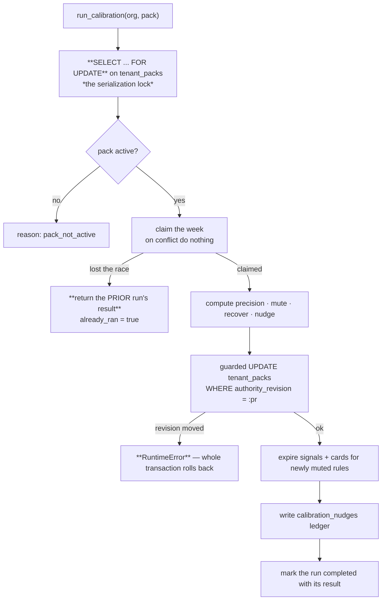

← [Precision and the Wilson Interval](02-Precision-and-Wilson-Bounds.md) · [Folder map](README.md) · → [Mutes, Nudges and the Audit Ledger](04-Mutes-Nudges-and-The-Ledger.md)

---

# Exact-Pack Lineage and the Weekly Claim

---

## Exact-pack lineage — no pooling across snapshots

The precision query groups by
`(pack_id, pack_version, authority_pack_revision, capability_id, capability_version, rule_id)`.

```python
if len(variants) == 1:
    stats[rule_id] = variants[0]
else:
    # Never pool two materially distinct capability snapshots. A pack can opt into
    # transfer later with explicit compatibility metadata; absence means HOLD.
    ambiguous_lineages.append(rule_id)
```

> A rule id is **not** globally unique across versions. Historical outcomes may tune a decision
> rule **only when they belong to the exact pack/version that produced it.**

When a rule has outcomes under two different capability snapshots, calibration **holds** rather
than averaging them — and reports `ambiguous_lineages_held` so the hold is visible.

This is the same reason `apply_to_tenant` **resets `lvl3_config` on a version change**
([Layer 3 §3.4](../Layer-3-Domain-Expertise/00-Overview.md)): a correction learned against different
arithmetic is not a correction.

Rules that are no longer in the current manifest are dropped from scoring entirely —
`current_rules` is read from `pack_registry.manifest`.

---

## The weekly claim — exactly one run, atomically

```python
run_id = stable_id("calrun", {org_id, pack_id, pack_version, period_start})
insert into calibration_runs (...) values (...)
  on conflict (org_id, pack_id, pack_version, period_start) do nothing
  returning run_id
```



Three interlocking guarantees:

1. **The tenant-pack row is the serialization lock** — two concurrent calibrations for one org
   cannot interleave.
2. **The claim, the mutes, the config write and the nudge ledger share one transaction** — *a
   crash therefore commits all of them or none.*
3. **The config update is guarded on `authority_revision`** — if anything else moved the tenant's
   authority while the row was locked, the whole run **raises and rolls back** rather than writing
   over it.

> A re-run in the same week returns the **prior run's stored result**, not an empty response. The
> caller gets the same answer twice, which is what idempotence should feel like.
