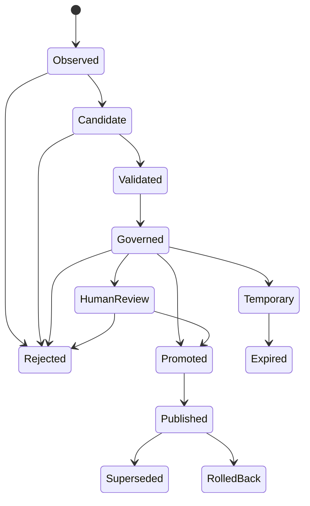

[← Folder map](README.md)

# Validation, promotion and enterprise governance

The immutable object and mutable state are separate. `learning_objects.payload` never changes;
`current_state` and `learning_transitions` record what the organization permitted over time.

Every arrow is locked by `ALLOWED_LEARNING_TRANSITIONS` in the cross-layer contract and enforced
again by a guarded SQL update. The ledger stores previous state, next state, reason, actor, detail
and time.

## Default validation policy

| Control | Default |
|---|---|
| Minimum observations | 3 |
| Minimum distinct days | 2 |
| Minimum confidence | 6500 bp |
| Maximum noise | 2500 bp |
| Maximum conflict | 2500 bp |
| Minimum business value | 1000 bp |
| Maximum temporary TTL | 720 hours |
| Human-review targets | Knowledge suggestion + Organization Brain |

An object below repetition remains Observed. Repetition without enough day diversity or confidence
remains Candidate. Noise, conflict, stale evidence, low business value, disabled learning or a
blocked subject rejects it. Strong evidence does not bypass target-level human review.

## Temporary-memory exception

A user saying “remember this until Friday” should not have to repeat it three times. Runtime memory
may validate from one observation only when it is explicitly marked, carries a future expiry, stays
under the tenant TTL ceiling, and can only target Runtime. It ends at Temporary and expires; it can
never drift into a permanent brain.

## Tenant policy surface

Owners read or replace the policy through `/v1/learning/policy`. Knowledge suggestions are forced
back into `require_human_targets` even if an update omits them. This hard rule is stronger than
tenant configuration: configuration may make learning stricter, never create an Expert publisher.
