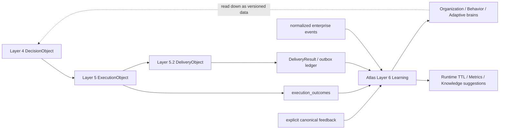

[← Atlas alignment](11-Atlas-Alignment.md) · [Folder map](README.md)

# Integration with Atlas Layers 5 and 5.2

Learning is useful only if the upstream facts mean what it thinks they mean. The closed loop uses
durable seams rather than cross-layer calls, so each layer retains one authority.

## Layer 5 → Learning: outcome authority

`execution_outcomes` is written exactly once when a commitment reaches a terminal truth. It binds
the decision/capability/play lineage, terminal label, progress, completion time, reminders,
escalations, assignee and subject. Learning groups the indexed
`(org, capability, play, closed_at)` cohort.

| Layer 5 label | Learning interpretation |
|---|---|
| `succeeded` | positive evidence |
| `expired_untouched`, `expired_in_progress`, `cancelled_by_human` | negative evidence |
| `completed_unproven`, `cancelled_by_world`, `cancelled_by_system` | visible neutral/unproven evidence |

Outcome Analysis publishes counted effectiveness; Recommendation Learning proposes adaptive play
statistics; sustained poor cohorts may create a Knowledge Evolution review suggestion. A button
click cannot replace this outcome truth.

## Layer 5.2 → Learning: delivery authority

The outbox row supplies transport state, attempts, deferrals, channel, reason and clocks. Performance
Optimization measures delivery reliability and latency while keeping policy suppression and open
work distinct from adapter failure.

This separation is critical: a correct recommendation delivered at a bad time is a delivery issue,
not evidence that the play or rule is wrong. Existing calibration similarly excludes `bad_timing`
and snooze actions from rule precision.

## Feedback → Learning: explicit judgment authority

`card_feedback_verdicts` stores one current canonical human verdict per card, with revisions in an
append-only history and exact pack/capability/rule lineage. Silence and passive impressions never
become labels. Structured explicit preference details may enter Preference/Behavior/Adaptive units;
free text must be structured before this deterministic boundary.

## Learned state → lower layers

The learning package is the highest numbered runtime layer. Lower packages cannot import it. Changes
flow downward only as data:

- existing rule mutes and bounded `lvl3_config.rule_offsets` affect pack merge/reasoning;
- versioned Organization/Behavior/Adaptive entries are published and API-visible, but no lower
  package reads them yet; a typed controlled materializer is an explicit integration gap;
- runtime memory expires independently and cannot become permanent, but also has no Context or
  Reasoning consumer yet;
- Knowledge Evolution stops at human review and never writes the Expert Brain.

The topology test enforces imports; database lineage, immutable LearningObjects and transition rows
enforce the data path.

Today the only learned-state path actually consumed below Layer 7 is the retained calibration
subsystem: active `rule_mutes` and bounded `lvl3_config.rule_offsets` are read by Reasoning. The
generic Atlas publishers must not be described as changing runtime behavior until their consumers
exist.
