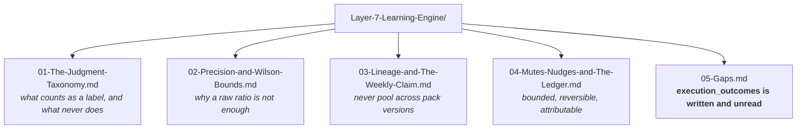

# Layer 7 · The Learning Engine — the folder map

**This folder is the live truth of `genios_engine/feedback/`.** It is the source consulted before any action,
update or improvement to this layer. If a document and the code disagree, the document is wrong —
fix it in the same change that moved the code.

Start at **[00-Overview.md](00-Overview.md)** for the layer in one sitting. Use this page when you
already know what you are looking for.

---

## The one question this layer answers

> **What should the system change about itself?**

---

## The documents

| # | Document | Answers |
|---|---|---|
| 00 | [Overview](00-Overview.md) | The four requirements, what exists, the write-down loop |
| 01 | [The Judgment Taxonomy](01-The-Judgment-Taxonomy.md) | Three classes — and why timing complaints are excluded from precision |
| 02 | [Precision and Wilson Bounds](02-Precision-and-Wilson-Bounds.md) | Always compared against the bound that makes the action harder |
| 03 | [Lineage and the Weekly Claim](03-Lineage-and-The-Weekly-Claim.md) | Exact-pack scoping, the row lock, and the revision guard |
| 04 | [Mutes, Nudges and the Ledger](04-Mutes-Nudges-and-The-Ledger.md) | ±5 a week, ±15 ever, and a mute that takes effect in the same commit |
| 05 | [Gaps](05-Gaps.md) | Layer 5 writes `execution_outcomes`; this layer still learns from clicks |

---

## Where this layer sits

| | |
|---|---|
| **Package** | `genios_engine/feedback/` |
| **Layer number** | 7 — `genios_engine/LAYERS.py` |
| **Spec alias** | The architecture atlas calls this **Layer 6 · Learning & Evolution** |
| **Reads from** | canonical human judgments on cards (Layer 6) |
| **Hands to** | `rule_mutes` rows + `lvl3_config.rule_offsets` — **written down as data** |
| **May import** | everything below. **Nothing imports it** |
| **LLM calls** | Zero |

[← System Design index](../README.md)
