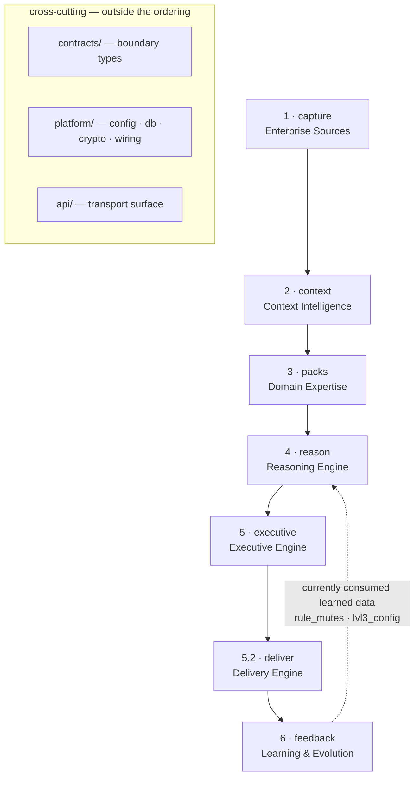

# GeniOS — System Design

This folder is the **engineering design record** of the GeniOS engine, written layer by
layer. It is not a tutorial and not a changelog. For every layer it answers four
questions, in this order:

1. **What was supposed to be built** — the intent, taken from the specs (`docs/LAYER_MAP.md`,
   `genios_engine/LAYERS.py`, the package docstrings, and the `Rohit_Updates/` progress notes).
2. **What actually exists** — the parts, subparts and units that are in the code today.
3. **How it was built** — mechanism, wiring, data flow, and the persisted seams.
4. **The internals** — inside each unit: the decisions, the constants, the edge cases,
   and *why* they are what they are.

Each layer overview carries the end-to-end diagrams and boundary map. Nested unit/component pages
carry the narrower input/output, runtime authority, invariants, scenarios and an honest **gap**
statement—what is built, partial, owned elsewhere or deliberately not done.

---

## The layer index

This index follows the canonical product architecture: **Layers 1, 2, 3, 4, 5, 5.2 and 6**.
Layer 5.2 is Delivery. Layer 6 is Learning & Evolution. There is no product Layer 7.
`genios_engine/LAYERS.py` records these product identifiers separately from integer import ranks;
the ranks exist only so `tests/test_layer_topology.py` can enforce dependency direction.

| # | Package | Name | Owns | Doc |
|---|---|---|---|---|
| 1 | `capture/` | Knowledge Layer *(Enterprise Sources)* | Read + normalize reality. Zero reasoning. | [Layer 1](Layer-1-Knowledge-Layer/00-Overview.md) *(32 docs)* |
| 2 | `context/` | Context Intelligence | The live digital twin: entities, facts, situations, attention. | [Layer 2](Layer-2-Context-Intelligence/README.md) *(34 docs)* |
| 3 | `packs/` | Domain Expertise | The four brains + capability content, shipped as data. | [Layer 3](Layer-3-Domain-Expertise/README.md) *(8 docs)* |
| 4 | `reason/` | Reasoning Engine | Deterministic cognition: orchestrator, 17 units, decision maker. | [Layer 4](Layer-4-Reasoning-Engine/00-Overview.md) *(93 docs)* |
| 5 | `executive/` | Executive Engine | Decision briefs + `ExecutionObject`; owns the commitment, work owner, actions, deadline and business priority. | [Layer 5](Layer-5-Executive-Engine/README.md) *(92 docs; nested by part → unit → component)* |
| 5.2 | `deliver/` | Delivery Engine | Resolves current audience/recipient, destination, channel, format, timing, policy and priority; owns delivery lifecycle, retry/recovery, analytics and `DeliveryResult`. | [Layer 5.2](Layer-5.2-Delivery-Engine/README.md) *(117 docs)* |
| 6 | `feedback/` | Learning & Evolution | Exact outcome/feedback/event lineage, 11 governed units, immutable v2 proposals, dynamic brains, TTL memory, metrics, human-only suggestions and calibration. | [Layer 6](Layer-6-Learning-and-Evolution/README.md) *(141 docs; nested by part → unit → component)* |
| — | `contracts/`, `platform/`, `api/` | Cross-cutting | Boundary types · composition root · transport. | [Cross-cutting](Cross-Cutting-Contracts-Platform-API/README.md) *(7 docs)* |

---

## The one architectural rule



**A lower import rank never imports a higher one.** Cross-layer needs are met two ways only:

- **Injection** — `platform/wiring.py` resolves a dependency and passes it *down*.
- **Data** — a table written above and read below (`rule_mutes`, `lvl3_config.rule_offsets`).

This is enforced as a build failure by `tests/test_layer_topology.py`, not as a review
convention. It is the mechanism that keeps domain knowledge out of the engine and
context out of expertise.

---

## End-to-end: one email's journey

```mermaid
flowchart LR
    src["Gmail<br/>Calendar<br/>Drive · Notion<br/>client DB<br/>uploads · typed notes"]
    src --> L1

    L1["**Layer 1 — capture**<br/>land · dedup · preprocess<br/>gate · triage"]
    L1 -- "GatedEvent" --> L2

    L2["**Layer 2 — context**<br/>extract · resolve identity<br/>merge into the graph"]
    L2 -- "entities · facts · situations" --> L4

    L3["**Layer 3 — packs**<br/>domain rules<br/>as data"]
    L3 -. "loaded as config" .-> L4

    L4["**Layer 4 — reason**<br/>rule eval · scoring<br/>baselines · foresight"]
    L4 -- "decisions" --> L5

    L5["**Layer 5 — executive**<br/>brief · ExecutionObject<br/>work owner · actions · deadline"]
    L5 -- "ExecutionObject only" --> L52

    L52["**Layer 5.2 — Delivery**<br/>current audience · context · routing<br/>policy · outbox · lifecycle · results"]
    L52 --> out["the person<br/>who has to act"]

    out -- "results + feedback + outcomes" --> L6["**Layer 6 — Learning & Evolution**<br/>exact lineage · 11 units · governance<br/>dynamic brains · TTL memory"]
    L6 -. "currently consumed: bounded calibration<br/>generic typed consumers pending" .-> L4
```



---

## How to read a layer document

Each **layer overview** follows the same skeleton:

```
§0  At a glance          — the layer in one table
§1  What was supposed    — the spec, quoted
§2  What exists          — parts → subparts → units inventory
§3  Anatomy              — every unit, opened up
§4  Workflows            — the flowcharts
§5  Strategies           — the design decisions, and why
§6  Gaps                 — what is broken or deliberately undone
§7  Map                  — files, tables, tests, endpoints
```

Diagrams are inline Mermaid. GitHub, VS Code (with a Mermaid preview extension) and most
Markdown viewers render them natively — no external service required.

Part and unit READMEs then index their children. A component-module leaf is intentionally narrower:
it documents its input, validation/retrieval, mechanism/calculation, output, edge cases and code
authority instead of repeating the whole layer-level §0–§7 skeleton.

### When a layer needs a folder instead of a file

A layer gets a **single file** by default. It gets a **folder** when one file would stop being
readable — and the test is the reader, not the line count: if a person arriving with one question
would have to scroll past four unrelated subsystems to reach their answer, split it.

Layer 4 is the first such case: three architectural parts, seventeen units, fifty-two analyzer
plugins, and a determinism/audit story that stands on its own. It lives in
`Layer-4-Reasoning-Engine/` with `00-Overview.md` as the entry point, which carries the §0–§7
skeleton for the layer as a whole and links down into the detail. Each file inside still follows
the four questions above; the folder simply lets a reader open the one that answers theirs.

**Layer 1 goes one level further** and nests by *stage*, because its four stages — sources,
connectors, normalization, qualification — are worked on by different people at different times
and share almost no code. `Layer-1-Knowledge-Layer/` holds four sub-folders, each with its own
`00-Overview.md` indexing its leaves:

```
Layer-1-Knowledge-Layer/
├── 00-Overview.md                    ← the entry point
├── 01-Knowledge-Sources/             what a source is, and what each one gives us
├── 02-Knowledge-Connectors/          how we connect, authenticate, remember position, and pull
├── 03-Normalization-and-Extraction/  raw bytes → one envelope, cleaned, masked, typed
└── 04-ESQE/                          the qualification funnel and everything it refuses
```

Nest by the architecture, not by an arbitrary depth limit. A simple layer can stay flat; a staged
layer uses `part/component`; and an Atlas-sized engine uses
`part/subpart/component-module`. Every level must answer a real ownership question and carry a
README index. Layers 5, 5.2 and 6 use the deeper form because their canonical design
explicitly separates orchestrators, named units, lifecycle/management and internal component
pipelines. The rule is **no decorative folders and no flattened architectural parts**.
