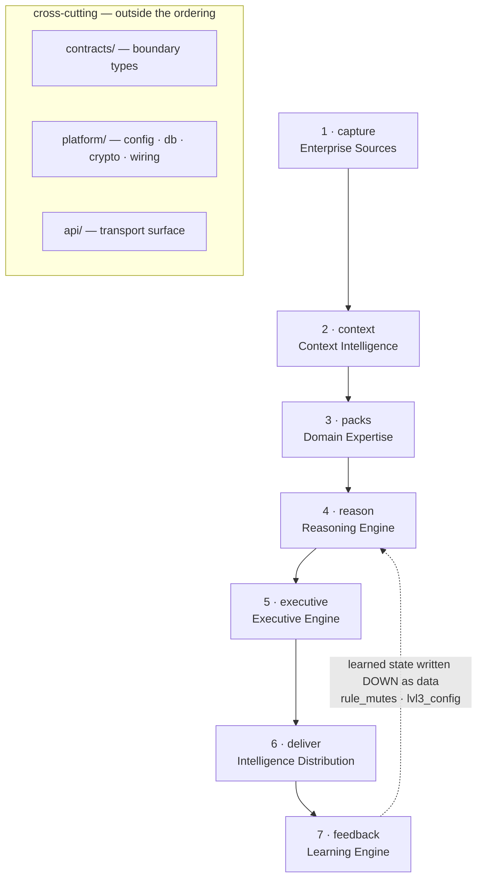
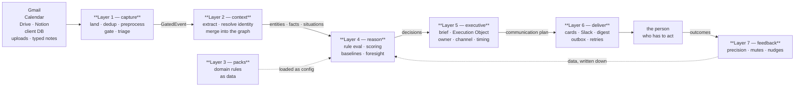

# GeniOS — System Design

This folder is the **engineering design record** of the GeniOS engine, written layer by
layer. It is not a tutorial and not a changelog. For every layer it answers four
questions, in this order:

1. **What was supposed to be built** — the intent, taken from the specs (`docs/LAYER_MAP.md`,
   `genios_engine/LAYERS.py`, the package docstrings, and the `Rohit_Updates/` progress notes).
2. **What actually exists** — the parts, subparts and units that are in the code today.
3. **How it was built** — mechanism, wiring, data flow, and the persisted seams.
4. **The internals** — inside each unit: the decisions, the constants, the edge cases,
   and *why* they are what they are.

Every layer document carries diagrams (Mermaid flowcharts, sequence and state diagrams),
a file-and-test map, and an honest **gaps** section — what is known-broken or deliberately
not done.

---

## The layer index

Three specs numbered these layers three different ways. The **package name** is the only
stable identity; the number lives in exactly one place in code, `genios_engine/LAYERS.py`,
and import direction is enforced by a test.

| # | Package | Name | Owns | Doc |
|---|---|---|---|---|
| 1 | `capture/` | Knowledge Layer *(Enterprise Sources)* | Read + normalize reality. Zero reasoning. | [Layer 1](Layer-1-Knowledge-Layer/00-Overview.md) *(32 docs)* |
| 2 | `context/` | Context Intelligence | The live digital twin: entities, facts, situations, attention. | [Layer 2](Layer-2-Context-Intelligence/README.md) *(34 docs)* |
| 3 | `packs/` | Domain Expertise | The four brains + capability content, shipped as data. | [Layer 3](Layer-3-Domain-Expertise/README.md) *(8 docs)* |
| 4 | `reason/` | Reasoning Engine | Deterministic cognition: orchestrator, 17 units, decision maker. | [Layer 4](Layer-4-Reasoning-Engine/00-Overview.md) *(93 docs)* |
| 5 | `executive/` | Executive Engine | Decision briefs + the Execution Object. Owns *who* and *where*. | [Layer 5](Layer-5-Executive-Engine/README.md) *(11 docs)* |
| 6 | `deliver/` | Intelligence Distribution *(spec: 5.2 Delivery)* | Cards, channels, digest, outbox, admission gate. | [Layer 6](Layer-6-Intelligence-Distribution/README.md) *(10 docs)* |
| 7 | `feedback/` | Learning Engine *(spec: 6 Learning & Evolution)* | Precision windows, nudges, mutes. Writes learned state **down** as data. | [Layer 7](Layer-7-Learning-Engine/README.md) *(7 docs)* |
| — | `contracts/`, `platform/`, `api/` | Cross-cutting | Boundary types · composition root · transport. | [Cross-cutting](Cross-Cutting-Contracts-Platform-API/README.md) *(7 docs)* |

---

## The one architectural rule



**A lower layer never imports a higher one.** Cross-layer needs are met two ways only:

- **Injection** — `platform/wiring.py` resolves a dependency and passes it *down*.
- **Data** — a table written above and read below (`rule_mutes`, `lvl3_config.rule_offsets`).

This is enforced as a build failure by `tests/test_layer_topology.py`, not as a review
convention. It is the mechanism that keeps domain knowledge out of the engine and
context out of expertise.

---

## End-to-end: one email's journey



---

## How to read a layer document

Each one follows the same skeleton:

```
§0  At a glance          — the layer in one table
§1  What was supposed    — the spec, quoted
§2  What exists          — parts → subparts → units inventory
§3  Anatomy              — every unit, opened up
§4  Workflows            — the flowcharts
§5  Strategies           — the design decisions, and why
§6  Gaps                 — what is broken or deliberately undone
§7  Map                  — files, tables, tests, endpoints
```

Diagrams are inline Mermaid. GitHub, VS Code (with a Mermaid preview extension) and most
Markdown viewers render them natively — no external service required.

### When a layer needs a folder instead of a file

A layer gets a **single file** by default. It gets a **folder** when one file would stop being
readable — and the test is the reader, not the line count: if a person arriving with one question
would have to scroll past four unrelated subsystems to reach their answer, split it.

Layer 4 is the first such case: three architectural parts, seventeen units, fifty-two analyzer
plugins, and a determinism/audit story that stands on its own. It lives in
`Layer-4-Reasoning-Engine/` with `00-Overview.md` as the entry point, which carries the §0–§7
skeleton for the layer as a whole and links down into the detail. Each file inside still follows
the four questions above; the folder simply lets a reader open the one that answers theirs.

**Layer 1 goes one level further** and nests by *stage*, because its four stages — sources,
connectors, normalization, qualification — are worked on by different people at different times
and share almost no code. `Layer-1-Knowledge-Layer/` holds four sub-folders, each with its own
`00-Overview.md` indexing its leaves:

```
Layer-1-Knowledge-Layer/
├── 00-Overview.md                    ← the entry point
├── 01-Knowledge-Sources/             what a source is, and what each one gives us
├── 02-Knowledge-Connectors/          how we connect, authenticate, remember position, and pull
├── 03-Normalization-and-Extraction/  raw bytes → one envelope, cleaned, masked, typed
└── 04-ESQE/                          the qualification funnel and everything it refuses
```

Nest a second level only when a layer's stages are genuinely separable work. Two levels is the
limit: below that, a reader stops being able to guess where something lives.
